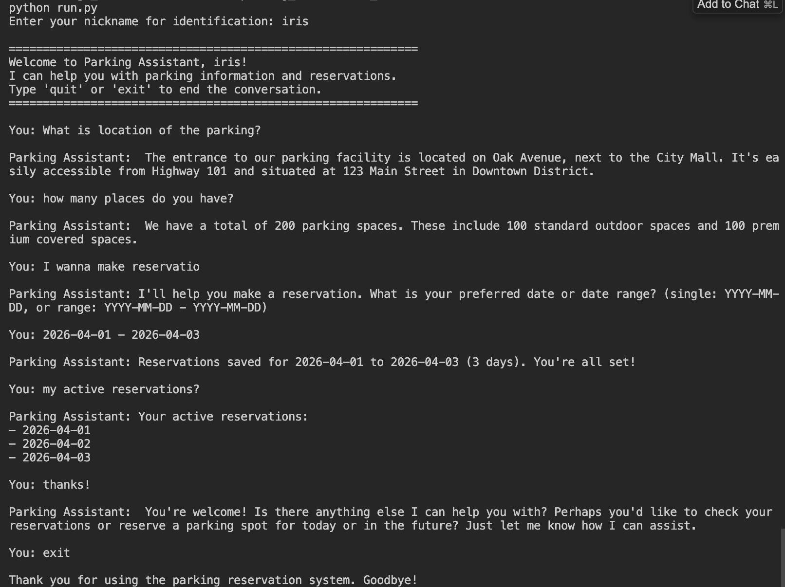

# Parking Reservation Chatbot

Chatbot for parking information and reservations (RAG + LangGraph). Identifies users by nickname, stores reservations in SQLite, uses FAISS with content from `rag_data/parking_info.txt`.

> **Want a high-level overview?** See **[docs/SYSTEM_SUMMARY.md](docs/SYSTEM_SUMMARY.md)** for what the system does, how user interaction works (chat, reserve, show reservations), and a concise technical overview (data, RAG, guardrails, evaluation).

### Screenshot

The image below shows the launched app and a sample interaction with the chatbot.



## Setup

### 1. Create and use a virtual environment

```bash
# Create venv in project root
python3 -m venv .venv

# Activate (Unix/macOS)
source .venv/bin/activate
```

### 2. Install dependencies

```bash
pip install -r requirements.txt
```

### 3. Optional: environment variables

```bash
cp .env_example .env
# Edit .env if you need to change model path, log level, etc.
```

## Run

set **PYTHONPATH**:

```bash
export PYTHONPATH=/path/to/parking_reservation_chatbot
```

From the **project root**:

```bash
python run_chatbot_agent.py
```

Enter a valid nickname (e.g. `alice`, `bob`) when prompted, then chat: ask for info, say "reserve" and give a date (YYYY-MM-DD), or "show my reservations".

## Tests

```bash
pytest tests/ -v
```

Or from the project root: **`make tests`**. See the **Makefile** for shortcuts: `make run`, `make lint`, `make evaluation`, `make evaluation_report_cosine`, `make evaluation_report_l2`.

## Linting

The project uses [Ruff](https://docs.astral.sh/ruff/) for linting (configured in `pyproject.toml`):

```bash
# Check code
ruff check .

# Auto-fix safe issues (e.g. import order)
ruff check . --fix

# Format code
ruff format .
```

## Evaluation report (system performance)

To generate an **evaluation report** on retrieval accuracy and performance (Recall@K, Precision@K, latency):

```bash
python run_evaluation.py
```

To save the report to a file:

```bash
python run_evaluation.py -o evaluation_report.txt
```

Use `--remove-index` to delete the FAISS index files after the run (`rag_data/faiss_parking.index`, `rag_data/faiss_parking_docs.json`), so the next run rebuilds the index (e.g. after changing `FAISS_METRIC` or `parking_info.txt`). See [docs/EVALUATION.md](docs/EVALUATION.md) for all options and metric definitions.

**FAISS similarity:** Set `FAISS_METRIC=cosine` (default) or `FAISS_METRIC=l2` in `.env`. After changing the metric, delete `rag_data/faiss_parking.index` (and optionally `rag_data/faiss_parking_docs.json`) so the index is rebuilt on next run. Details in [docs/EVALUATION.md](docs/EVALUATION.md#faiss-similarity-metric).

## Documentation

Technical docs are in the **`docs/`** folder:

- **[docs/SYSTEM_SUMMARY.md](docs/SYSTEM_SUMMARY.md)** — **Start here for general info:** what the system does, how users interact (chat, reserve, show reservations), and technical overview (data, RAG, guardrails, evaluation)
- **[docs/INDEX.md](docs/INDEX.md)** — Index and overview
- **[docs/DATA_FLOW.md](docs/DATA_FLOW.md)** — End-to-end data flow (startup, chat, RAG, reservations, DB)
- **[docs/CODE_STRUCTURE.md](docs/CODE_STRUCTURE.md)** — Project layout and how each module is used
- **[docs/TESTING_GUARDRAILS.md](docs/TESTING_GUARDRAILS.md)** — How to test guardrails

## Requirements

- Python 3.10+
- `requirements.txt`: LangChain, LangGraph, GPT4All, sentence-transformers, pytest, ruff (linting), etc. SQLite is used via the standard library (no extra package).
