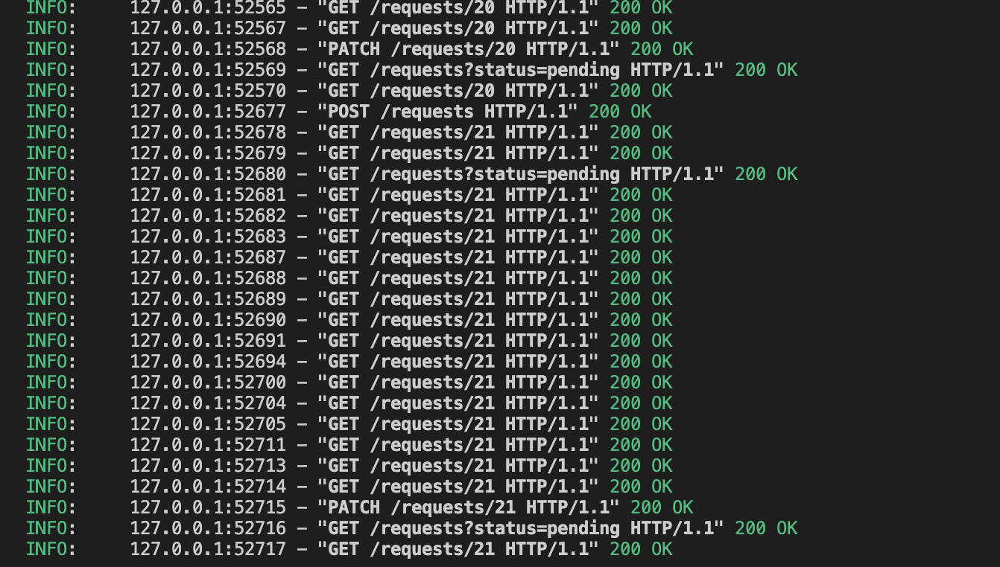
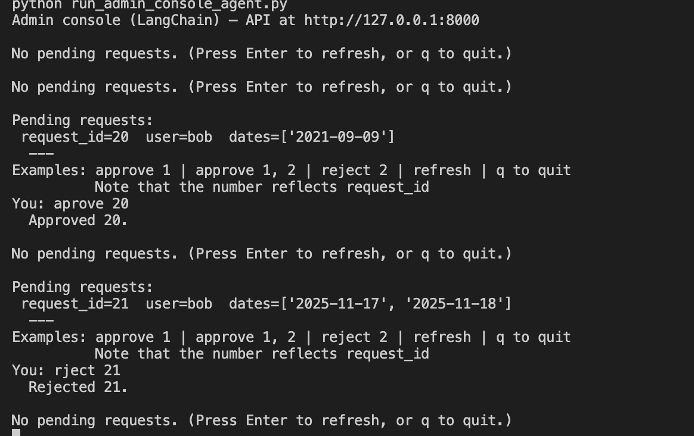

# Human-in-the-Loop: Reservation Escalation — Design Summary

Reservation requests are escalated to a human administrator. The chatbot sends a pending request via the admin REST API; the administrator approves or rejects via the admin console; the chatbot learns the outcome by polling the API and, on approval, writes to the `reservations` table.

**Channel:** REST only. The chatbot and the admin console use the same admin API for create and status. There is no DB fallback: if the API is not configured or unreachable, the client raises `AdminAPIUnavailableError`.

**Flow in short:** Chatbot collects nickname and dates, checks availability, then POSTs to `/requests` instead of writing to `reservations`. The API stores a row in `reservation_requests` with status `pending`. The admin console lists pending requests (GET `/requests?status=pending`), the administrator approves or rejects (PATCH `/requests/{id}`). The chatbot polls GET `/requests/{id}` until status is `approved` or `rejected`; on approval it loads request details and calls `add_reservation` for each date.

---

## 1. Data Layer

**Table:** `reservation_requests` in `src/db/sqlite_db.py` (same DB as `reservations`).

**Columns:** `id`, `nickname`, `dates_json`, `status` (`pending` | `approved` | `rejected`), `created_at`, `updated_at`.

**Writes:** Only the admin API writes to this table (on POST create and PATCH status). The chatbot never writes to it; it uses the API client. The admin console does not access the DB; it uses the API.

**Reads:** The API reads for list/get/update. The chatbot reads status via the API and, after approval, loads `(nickname, dates)` via `get_pending_request_details` from the DB to apply the reservation.

**Main methods:** `create_pending_request`, `get_request_status`, `set_request_status`, `get_pending_request_details`, `get_reservation_request`, `list_reservation_requests`.

---

## 2. Admin REST API

**Implementation:** `src/admin_api/app.py`. Run with `run_admin_api.py` (e.g. uvicorn on port 8000).

**Endpoints:** POST `/requests` (create, returns `request_id`); GET `/requests` (list, optional `?status=`); GET `/requests/{request_id}` (one); PATCH `/requests/{request_id}` (body `{ "status": "approved" | "rejected" }`, 409 if not pending).

**Config:** Same DB as the rest of the app. `ADMIN_API_BASE_URL` (e.g. `http://127.0.0.1:8000`) is used by the chatbot and by the admin console.

---

## 3. Admin API Client (Chatbot Side)

**Module:** `src/admin_api/client.py`.

**Functions:** `create_request(nickname, dates)` POSTs to the API and returns `request_id`; `get_request_status(request_id)` GETs status; `get_pending_request_details(request_id)` returns `(nickname, dates)` from the DB (no API endpoint). All create/status calls go through the API; no fallback. `AdminAPIUnavailableError` is raised when the URL is unset or the API is unreachable.

---

## 4. Admin Console Agent

**Script:** `run_admin_console_agent.py`. Console-only; no web UI.

**Role:** Lets the administrator see pending requests and approve or reject them. It uses only the admin API (GET list, PATCH status).

**Behaviour:** Loop: fetch pending (GET `/requests?status=pending`), display each request with `request_id`, nickname, and dates, then prompt for input. The administrator types a line such as `approve 15`, `aprov 12`, or `reject 8, 9`. The script uses a **LangChain prompt + LLM** to interpret that line into a list of actions (e.g. approve 15, reject 8, reject 9). The prompt instructs the model to output only a single line in the form `approve N` or `reject N`, comma-separated; typos in the command word are accepted. The LLM output is parsed with a regex; the part after the first `\n\n` is discarded to avoid code or explanation. Parsed actions are then executed by calling the API (PATCH for each id). An LLM instance is created once (via `LLMProvider`, temperature 0) and reused. Commands `refresh` (re-list) and `q` (quit) are handled without the LLM.

**Display:** Each pending request is shown with `request_id`, user nickname, and dates. The number the admin types is the `request_id` (e.g. `approve 15` approves the request with id 15).

---

## 5. Chatbot Escalation and Polling

**Modules:** `src/chatbot/reservation_handler.py`, `src/chatbot/chatbot.py`.

**ReservationHandler:** After availability check, it calls `create_request(nickname, dates)` (client POST) instead of writing to `reservations`. It returns `(True, "pending_approval", request_id)`. When the admin has approved, `apply_approved_request(request_id)` loads details via `get_pending_request_details` and calls `db.add_reservation` for each date.

**Chatbot _handle_reservation:** On `(True, "pending_approval", request_id)` it informs the user and polls `get_request_status(request_id)` every 2 seconds (max 300 s). On `approved` it calls `apply_approved_request` and confirms to the user; on `rejected` or timeout it shows the appropriate message. `AdminAPIUnavailableError` during polling is caught and surfaced to the user.

---

## 6. Configuration and Run Order

**ADMIN_API_BASE_URL** must be set for the chatbot to create and poll requests. Typical order: start the admin API, then (optionally) the MCP reservation logger, then the admin console, then the chatbot (all can run on one machine with default URLs).

### 6.1 MCP Reservation Action Logger

**Purpose:** When the administrator **approves** a request (in the admin console), the **chatbot** (in its LangGraph **record_data** node) appends the action to a CSV file for audit/logging using the **open-source** [@modelcontextprotocol/server-filesystem](https://www.npmjs.com/package/@modelcontextprotocol/server-filesystem) (Node.js). Rejections are not logged. The admin console only PATCHes the API; the chatbot performs MCP logging when it sees approval (after polling).

**Behaviour:** The chatbot's record_data node (after wait_for_approval sees status=approved) calls **apply_approved_request** then starts the filesystem MCP server **once** (on first log) via `npx -y @modelcontextprotocol/server-filesystem <reservations_mcp_dir>`, and appends one row to `reservations_mcp/reservations_log.csv` (columns: **name**, **car_number**, **reservation_period**, **approval_time** UTC ISO). The npx process is closed when the chatbot process exits. **Prerequisites:** Node.js and npx (for the process running the chatbot). See [MCP_FILESYSTEM_SETUP.md](MCP_FILESYSTEM_SETUP.md).

---

## 7. End-to-End Call Flow (Summary)

User provides dates → chatbot checks availability → client POST `/requests` → API creates pending row → chatbot shows “Waiting for approval…” and polls GET `/requests/{id}`. Administrator runs the console, sees the list, types e.g. `approve 15` → LLM interprets → console PATCHes `/requests/15` with `approved`. Chatbot sees status `approved`, calls `apply_approved_request` (DB read for details, then `add_reservation` per date), then tells the user the reservation is saved.

---

## 8. File Layout

| Path | Purpose |
|------|---------|
| `src/db/sqlite_db.py` | `reservation_requests` table and related DB methods |
| `src/admin_api/app.py` | FastAPI: POST/GET/PATCH for requests |
| `src/admin_api/client.py` | create_request, get_request_status, get_pending_request_details; AdminAPIUnavailableError |
| `src/chatbot/reservation_handler.py` | create_request after availability; apply_approved_request |
| `src/chatbot/chatbot.py` | _handle_reservation: pending detection, polling, apply on approve |
| `run_admin_api.py` | Run the admin API process |
| `run_admin_console_agent.py` | Console: GET pending, LLM-interpreted input, PATCH approve/reject only (MCP logging is in the chatbot's record_data node) |
| `run_chatbot_agent.py` | Chatbot entry (requires ADMIN_API_BASE_URL for escalation) |
| `src/mcp_reservation_logger/client_fs.py` | Spawns @modelcontextprotocol/server-filesystem (npx), read_text_file + write_file to append CSV |

Tests cover the API (`tests/test_admin_api.py`), MCP client_fs helpers (`tests/test_mcp_reservation_logger.py`), and DB behaviour for reservation requests.
