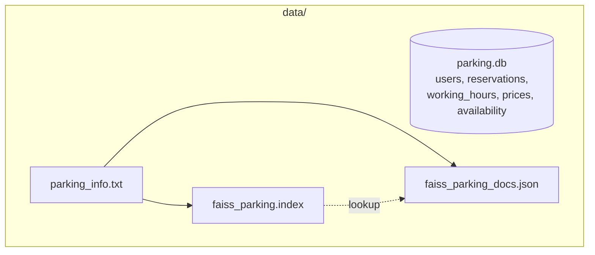
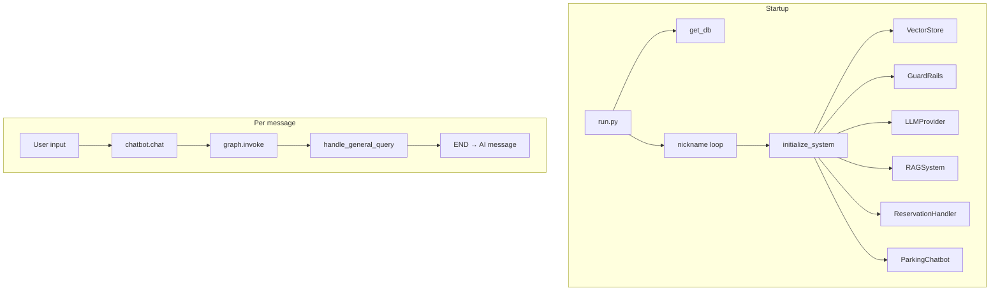
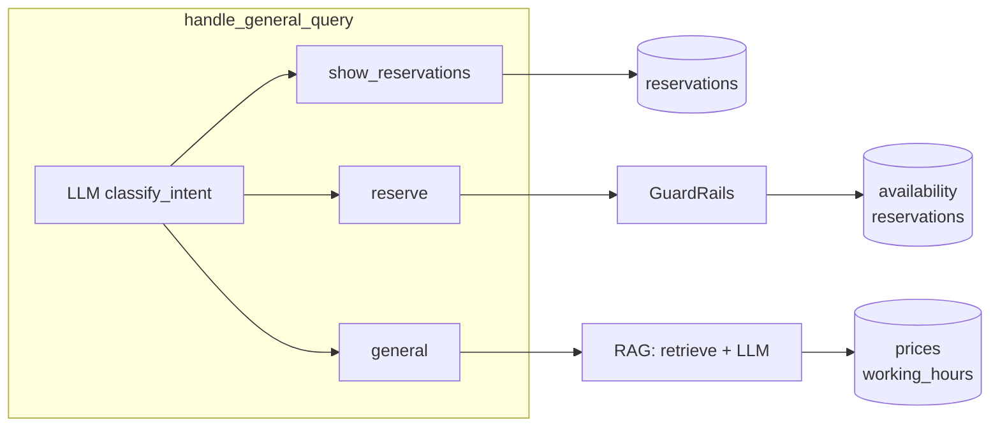
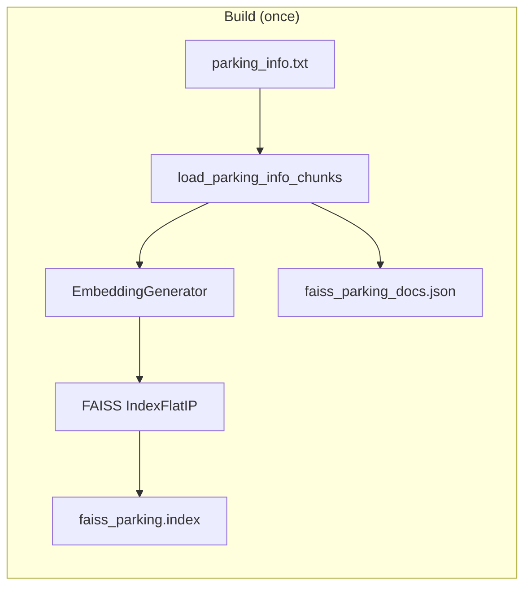
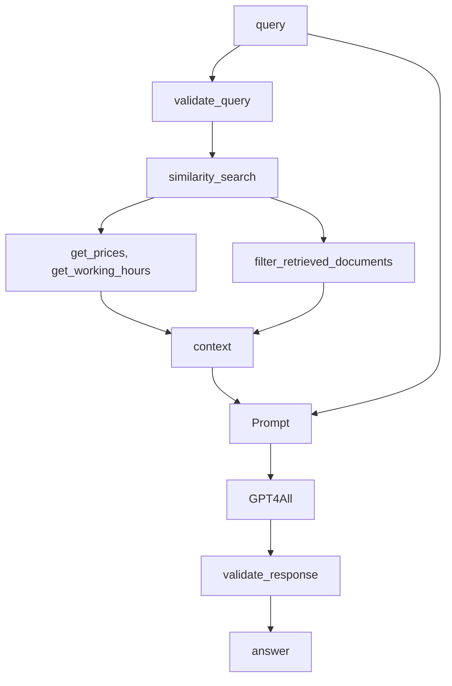
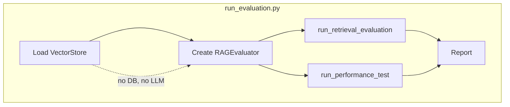
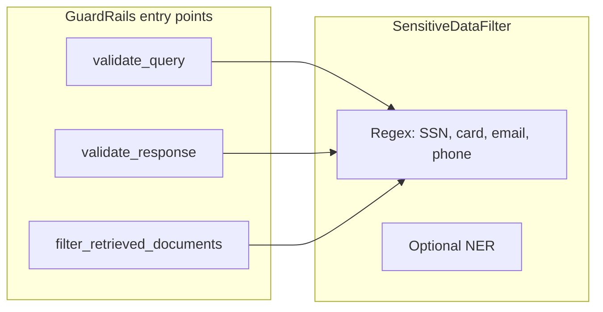
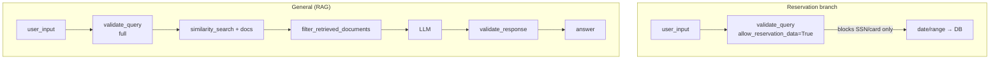

# System summary

Structured overview of the Parking Reservation Chatbot: data storages, data flow, RAG system, evaluation, and guardrails.

---

## 1. Data storages

| Storage | Location | Role |
|--------|----------|------|
| **SQLite** | `data/parking.db` | All dynamic data. Single DB instance shared by RAG and reservations. |
| **Static text** | `data/parking_info.txt` | Source for RAG: location, capacity, hours, booking, payment, contact. |
| **FAISS index** | `data/faiss_parking.index` | Vector index (embeddings of chunks). Built from parking_info.txt; load/save on disk. |
| **Doc store** | `data/faiss_parking_docs.json` | Id, content, metadata per chunk; used to resolve FAISS results to text. |

**SQLite schema**

- **users** — nickname, plates (startup: `user_exists`).
- **reservations** — nickname, date (one row per reserved day).
- **working_hours**, **prices** — read by RAG for dynamic context.
- **availability** — date, free_spaces; read when reserving.

**Who reads/writes**

- **run.py (startup):** reads `users`.
- **RAGSystem:** reads `prices`, `working_hours`; writes nothing.
- **ReservationHandler:** reads `availability`; writes `reservations`.
- **Show reservations:** reads `reservations` by nickname.



---

## 2. Data flow

**Startup (run.py)**

1. Project root on `sys.path`, `chdir` to project root; `setup_logging()`.
2. `get_db()` → SQLiteDB singleton (`data/parking.db`).
3. Nickname loop: `input()` until `db.user_exists(nickname)`.
4. `initialize_system(nickname)` builds once per run: VectorStore (FAISS over parking_info.txt), GuardRails, LLMProvider (GPT4All), RAGSystem(vector_store, llm, guard_rails, db), ReservationHandler(db, nickname), ParkingChatbot(rag_system, reservation_handler). Same `db` shared by RAG and ReservationHandler.

**Per user message**

1. User input → `chatbot.chat(user_input, conversation_history)`.
2. State = `{messages: history + HumanMessage(user_input)}`; `graph.invoke(state)`.
3. **handle_general_query** is always the single graph node: it runs first, then delegates internally.
4. Handler appends AIMessage → END; last AI message returned to run.py; response printed and appended to history.

**Intent routing (inside handle_general_query)**

- If **reservation in progress** (`get_current_reservation()` is not None): if the message **looks like a date** (YYYY-MM-DD or date range) → `_handle_reservation`. Otherwise **LLM classifies intent** so the user can do something else: **show_reservations** or **general** clear the current reservation and run that handler/RAG; **reserve** or unclear → `_handle_reservation`.
- Else **LLM classifies intent** via `rag_system.classify_intent(user_input)` → one of: **reserve**, **show_reservations**, **general**.
  - **reserve** → `_handle_reservation` (guardrails + date/range → DB).
  - **show_reservations** → `_handle_show_reservations` (DB only, list dates).
  - **general** → RAG: query validation → retrieval → LLM → response validation; answer is returned as the AI message.

**Handler data flow (summary)**

- **handle_show_reservations:** `get_reservations_by_nickname(nickname)` → one AI message. No RAG/LLM.
- **handle_reservation:** validate_query(allow_reservation_data=True); parse date or range (YYYY-MM-DD or YYYY-MM-DD - YYYY-MM-DD); for each date `get_free_spaces` then `add_reservation`; one row per day. Writes only `reservations`.
- **handle_general_query (when general):** validate_query (full); similarity_search + get_prices/get_working_hours; filter_retrieved_documents; LLM prompt; validate_response. Reads vector store + prices + working_hours; writes nothing.





---

## 3. RAG system

**Purpose:** Answer general questions using static content (parking_info.txt) plus dynamic DB data (prices, working hours).

**Build (once)**

- `data/parking_info.txt` → **load_parking_info_chunks()** (split by blank lines) → list of `{content, metadata}`.
- Chunks → **EmbeddingGenerator** (sentence-transformers) → vectors → **FAISS IndexFlatIP** (normalized → cosine). Index and doc store saved to disk (`data/faiss_parking.index`, `data/faiss_parking_docs.json`). On next run, load from disk if present.

**Query path (generate_response)**

1. **Retrieve:** `vector_store.similarity_search(query, k)` → top-k chunks (id, content, metadata, score).
2. **Dynamic context:** `db.get_prices()`, `db.get_working_hours()` → text appended to context.
3. **Guardrails:** `guard_rails.validate_query(query)`; `guard_rails.filter_retrieved_documents(documents)`.
4. **Prompt:** "Use the following context... Context: {chunks + prices/hours}\n\nQuestion: {query}\nAnswer:"
5. **LLM:** GPT4All generates answer.
6. **Response guardrails:** `guard_rails.validate_response(response)` → redacted answer returned.

**Components**

- **VectorStore** — EmbeddingGenerator + FAISSStore; `similarity_search`, `get_relevant_context`.
- **RAGSystem** — VectorStore, LLMProvider, GuardRails, optional DB; `classify_intent(user_input)` uses the LLM to return one of `reserve`, `show_reservations`, `general`; `generate_response` implements the RAG steps above.





---

## 4. Evaluation

**Scope:** Retrieval only (no LLM). Same vector store and embeddings as the chatbot. Fixed test queries and ground-truth relevant document IDs (chunk IDs 1, 2, 3, … = paragraph order in parking_info.txt). **Filter:** In `run_retrieval_evaluation()`, top-k chunks are filtered by similarity score ≥ 0.5 before computing Recall@K and Precision@K.

**Metrics**

| Metric | Definition |
|--------|------------|
| **Recall@K** | (relevant docs in top-K) / (total relevant docs). |
| **Precision@K** | (relevant docs in top-K) / K. |
| **Retrieval latency** | Time (ms) for one similarity search (embed query + FAISS search). Mean, min, max. |

**Components**

- **eval_dataset.py** — `EvalItem(query, relevant_doc_ids)`; `DEFAULT_EVAL_DATASET`.
- **rag_evaluator.py** — `RAGEvaluator(vector_store, eval_dataset, k_values)`; `run_retrieval_evaluation()` (filters top-k by score ≥ 0.5, then computes metrics), `run_performance_test(num_runs, k)`; `EvaluationReport`; `format_report(report)`.

**Run**

- `python run_evaluation.py` — loads VectorStore, runs retrieval evaluation (e.g. k=1,3,5) and performance test (e.g. 5 runs). No DB or LLM.

**Tests**

- `tests/test_rag_evaluation.py` — metrics and report with a mock vector store (no embedding model).

```mermaid
flowchart LR
  DS[eval_dataset.py\nEvalItem, DEFAULT_EVAL_DATASET] --> EV[RAGEvaluator]
  VS[VectorStore] --> EV
  EV --> RET[run_retrieval_evaluation]
  EV --> PERF[run_performance_test]
  RET --> R[Recall@K]
  RET --> P[Precision@K]
  RET --> L[retrieval latency]
  PERF --> L
```



---

## 5. Guardrails

**Purpose:** Prevent sensitive data from reaching the LLM or the user (SSN, card, email, phone).

**GuardRails (entry points)**

- **validate_query(query, allow_reservation_data=False)** — Before using the query. Full check (SSN, card, email, phone) or, if `allow_reservation_data=True`, only SSN and credit-card blocked (allows dates/names). Returns safe or error.
- **validate_response(response)** — After LLM; returns (safe, filtered_response); redacts if needed.
- **filter_retrieved_documents(documents)** — Filter/redact chunks before passing to the LLM.

**SensitiveDataFilter (underlying)**

- Regex patterns: SSN, credit card, email, US phone. Optional NER (transformers). `contains_sensitive_data`, `filter_sensitive_data`, `filter_documents`. Used only via GuardRails.

**Where used**

- **Reservation branch:** `validate_query(user_input, allow_reservation_data=True)` — blocks SSN/card only.
- **General (RAG):** `validate_query(user_input)` (full); `filter_retrieved_documents(docs)` before LLM; `validate_response(response)` after LLM.

Config: guardrails on/off and threshold in `src/config.py` (e.g. from `.env`).




